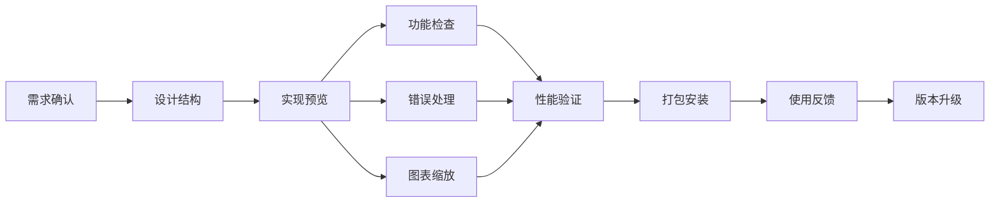

# 图表阅读与稳定性

图表默认适应宽度。点击“实际大小”后可横向滚动；“放大”和“缩小”调整比例。

```mermaid
flowchart LR
  A[需求确认] --> B[设计结构] --> C[实现预览] --> D[功能检查] --> E[性能验证] --> F[打包安装] --> G[使用反馈] --> H[版本升级]
  C --> I[错误处理] --> E
  C --> J[图表缩放] --> E
```

## 多节点图表

```mermaid
flowchart LR
  N1[节点 1] --> N2[节点 2]
  N2[节点 2] --> N3[节点 3]
  N3[节点 3] --> N4[节点 4]
  N4[节点 4] --> N5[节点 5]
  N5[节点 5] --> N6[节点 6]
  N6[节点 6] --> N7[节点 7]
  N7[节点 7] --> N8[节点 8]
  N8[节点 8] --> N9[节点 9]
  N9[节点 9] --> N10[节点 10]
  N10[节点 10] --> N11[节点 11]
  N11[节点 11] --> N12[节点 12]
  N12[节点 12] --> N13[节点 13]
  N13[节点 13] --> N14[节点 14]
  N14[节点 14] --> N15[节点 15]
  N15[节点 15] --> N16[节点 16]
  N16[节点 16] --> N17[节点 17]
  N17[节点 17] --> N18[节点 18]
  N18[节点 18] --> N19[节点 19]
  N19[节点 19] --> N20[节点 20]
  N20[节点 20] --> N21[节点 21]
  N21[节点 21] --> N22[节点 22]
  N22[节点 22] --> N23[节点 23]
  N23[节点 23] --> N24[节点 24]
  N24[节点 24] --> N25[节点 25]
  N25[节点 25] --> N26[节点 26]
  N26[节点 26] --> N27[节点 27]
  N27[节点 27] --> N28[节点 28]
  N28[节点 28] --> N29[节点 29]
  N29[节点 29] --> N30[节点 30]
  N30[节点 30] --> N31[节点 31]
  N31[节点 31] --> N32[节点 32]
  N32[节点 32] --> N33[节点 33]
  N33[节点 33] --> N34[节点 34]
  N34[节点 34] --> N35[节点 35]
  N35[节点 35] --> N36[节点 36]
  N36[节点 36] --> N37[节点 37]
  N37[节点 37] --> N38[节点 38]
  N38[节点 38] --> N39[节点 39]
  N39[节点 39] --> N40[节点 40]
  N40[节点 40] --> N41[节点 41]
  N41[节点 41] --> N42[节点 42]
  N42[节点 42] --> N43[节点 43]
  N43[节点 43] --> N44[节点 44]
  N44[节点 44] --> N45[节点 45]
  N45[节点 45] --> N46[节点 46]
  N46[节点 46] --> N47[节点 47]
  N47[节点 47] --> N48[节点 48]
  N48[节点 48] --> N49[节点 49]
  N49[节点 49] --> N50[节点 50]
  N50[节点 50] --> N51[节点 51]
  N51[节点 51] --> N52[节点 52]
  N52[节点 52] --> N53[节点 53]
  N53[节点 53] --> N54[节点 54]
  N54[节点 54] --> N55[节点 55]
  N55[节点 55] --> N56[节点 56]
  N56[节点 56] --> N57[节点 57]
  N57[节点 57] --> N58[节点 58]
  N58[节点 58] --> N59[节点 59]
  N59[节点 59] --> N60[节点 60]
```
